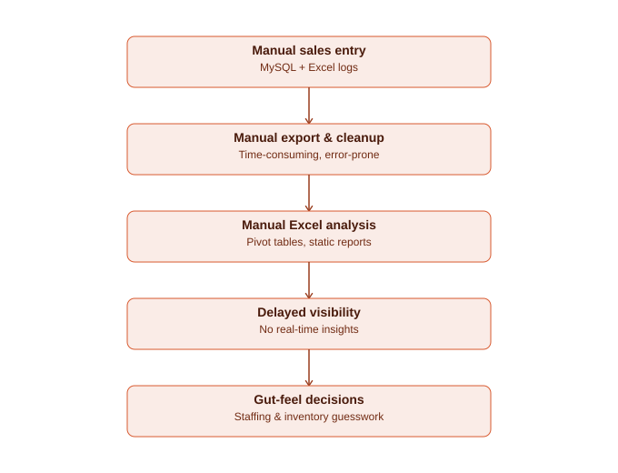
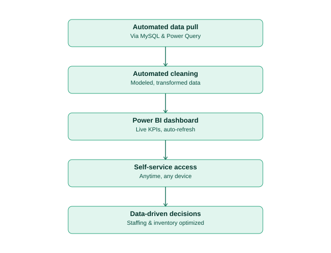

# Pizza Sales Power BI Dashboard — Business Analyst Documentation
### (Requirement Gathering, BRD, FRD, AS-IS/TO-BE)

**Project context:** This document reframes the Pizza Sales Power BI dashboard as a full business analysis engagement — from stakeholder requirement gathering through to the delivered dashboard — rather than just a technical build. Data was sourced from MySQL and Excel, cleaned using Power Query, and modeled into a Power BI dashboard.

---

## 1. Requirement Gathering (Stakeholder Interview Notes)

Simulated stakeholder interview notes — the standard first BA activity before any solution design.

| Stakeholder | Stated need | Priority |
|---|---|---|
| Restaurant Owner | "I want to know our peak hours so I can schedule staff properly and stop overstaffing during slow periods." | High |
| Restaurant Owner | "I want a monthly view of total sales and revenue to track business performance." | High |
| Store Manager | "I want to know which pizzas sell the most so I never run out of stock on our best sellers." | High |
| Store Manager | "I want to know which pizzas barely sell, so I can consider removing them from the menu." | Medium |
| Owner | "I want to know our busiest days of the week to plan promotions and staffing." | Medium |
| Owner | "I don't want to wait days for a report — I want to check this whenever I need to." | High |

**Notes:** Requirements were prioritized using a simple High/Medium scale based on direct business impact (cost savings, revenue, waste reduction).

---

## 2. Business Requirement Document (BRD)

**Document control:** v1.0 | Author: <Your Name>, Business Analyst | Project: Pizza Sales Analytics

### 2.1 Business Objective
Enable the restaurant owner/manager to make data-driven decisions on staffing, inventory, and menu strategy by replacing manual, delayed sales reporting with a real-time analytics dashboard.

### 2.2 Scope
- **In scope:** Sales order data (date, time, pizza type, quantity, price) sourced from MySQL and Excel exports; dashboard covering time-based trends, product performance, and revenue.
- **Out of scope:** Inventory/procurement system integration, customer-level loyalty data, POS system changes.

### 2.3 Assumptions & Constraints
- Historical sales data is available in MySQL and/or Excel format.
- Dashboard is for internal management use only (not customer-facing).
- Refresh frequency depends on data source access (manual or scheduled refresh in Power BI).

### 2.4 Business Requirements

| ID | Requirement |
|---|---|
| BR-01 | The business needs visibility into peak order times (hour of day) to optimize staff scheduling. |
| BR-02 | The business needs visibility into peak order days (day of week) to plan staffing and promotions. |
| BR-03 | The business needs to identify the top 5 best-selling pizzas to prioritize inventory stock. |
| BR-04 | The business needs to identify low-performing menu items as candidates for removal. |
| BR-05 | The business needs total sales and revenue figures, viewable by time period. |
| BR-06 | The business needs this information available on demand, without waiting for manual reports. |

### 2.5 Success Criteria / KPIs
- Staff scheduling aligned with actual peak-hour data (measured qualitatively post-rollout)
- Reduction in stockouts of top-selling pizzas
- Manager can retrieve sales insights in under 1 minute (vs. multi-day manual reporting previously)

---

## 3. Functional Requirement Document (FRD)

| BR ID | FR ID | Functional Requirement |
|---|---|---|
| BR-01 | FR-01.1 | Dashboard shall display order volume broken down by hour of day. |
| BR-02 | FR-02.1 | Dashboard shall display order volume broken down by day of week. |
| BR-03 | FR-03.1 | Dashboard shall display a ranked list of the top 5 pizzas by quantity sold. |
| BR-04 | FR-04.1 | Dashboard shall display the lowest-performing pizzas by quantity sold. |
| BR-05 | FR-05.1 | Dashboard shall display total sales and total revenue, filterable by month. |
| BR-06 | FR-06.1 | Data shall be extracted from MySQL and Excel sources, cleaned and transformed using Power Query, and loaded into a self-refreshing Power BI model. |

---

## 4. AS-IS Process (Before the dashboard)

1. Sales data recorded in MySQL and manual Excel logs
2. Manager manually exports and consolidates data
3. Manual Excel pivot-table analysis — time-consuming and error-prone
4. Delayed, limited visibility into peak times and top sellers
5. Staffing and inventory decisions made on gut feeling rather than data

## 5. TO-BE Process (With the dashboard)

1. Data automatically pulled from MySQL and Excel via Power Query
2. Data cleaned, transformed, and modeled automatically
3. Power BI dashboard delivers live KPIs: peak time, peak day, top 5 pizzas, revenue trends
4. Manager accesses the dashboard anytime, self-service
5. Staffing and inventory decisions become data-driven

---

## 6. User Stories & Acceptance Criteria

| ID | User Story | Acceptance Criteria |
|---|---|---|
| US-01 | As the store manager, I want to see order volume by hour, so that I can schedule staff efficiently. | Dashboard displays hourly order volume; updates with each data refresh. |
| US-02 | As the owner, I want to see the top and bottom performing pizzas, so that I can adjust inventory and the menu. | Dashboard ranks all items by quantity sold, filterable by month. |
| US-03 | As the owner, I want monthly revenue trends, so that I can measure the impact of promotions. | Dashboard shows a revenue trend line, filterable by date range. |

## 7. Requirement Traceability Matrix (RTM)

| BR ID | FR ID | User Story | Validated By | Status |
|---|---|---|---|---|
| BR-01 | FR-01.1 | US-01 | TC-01 | Passed |
| BR-02 | FR-02.1 | — | TC-02 | Passed |
| BR-03 | FR-03.1 | US-02 | TC-03 | Passed |
| BR-05 | FR-05.1 | US-03 | TC-04 | Passed |

## 8. UAT / Validation Test Cases

| TC ID | Requirement | Test Steps | Expected Result | Status |
|---|---|---|---|---|
| TC-01 | FR-01.1 | Filter dashboard by a known busy hour from raw data | Hourly chart matches raw order count for that hour | Passed |
| TC-02 | FR-02.1 | Filter dashboard by a known busy day of week | Day-of-week chart matches raw order count | Passed |
| TC-03 | FR-03.1 | Cross-check top 5 pizzas against raw quantity totals | Dashboard ranking matches manual SQL aggregation | Passed |
| TC-04 | FR-05.1 | Compare dashboard monthly revenue to SUM() in SQL | Values match within rounding | Passed |
