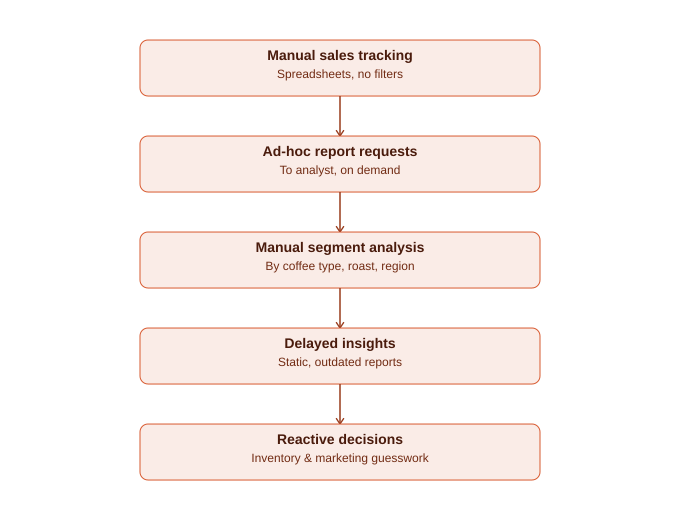
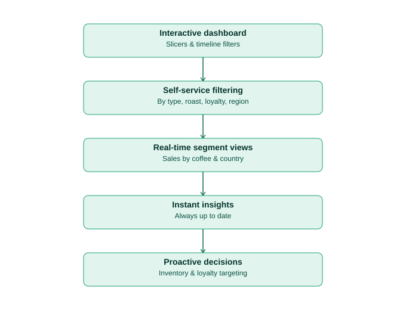

# Coffee Shop Sales Excel Dashboard — Business Analyst Documentation
### (Requirement Gathering, BRD, FRD, AS-IS/TO-BE, User Stories, RTM, UAT)

**Project context:** This document reframes the Coffee Shop Sales Excel dashboard as a full business analysis engagement. The dashboard tracks sales by coffee type (Arabica, Excelsa, Liberica, Robusta), roast (Dark, Light, Medium), serving size, loyalty card status, and country (Ireland, United Kingdom, United States), with monthly/date filtering via a timeline slicer.

---

## 1. Requirement Gathering (Stakeholder Interview Notes)

| Stakeholder | Stated need | Priority |
|---|---|---|
| Store/Regional Manager | "I want to see monthly sales trends by coffee type so I can plan seasonal inventory." | High |
| Marketing Manager | "I want to know if loyalty card holders actually spend more, so I can measure the loyalty program's impact." | High |
| Regional Manager | "I want to see which countries are driving sales so I can allocate marketing budget properly." | Medium |
| Store Manager | "I want to see which roast types and sizes sell best so I can adjust stocking levels." | Medium |
| Owner | "I want to filter by any date range without asking someone to rebuild the report each time." | High |

---

## 2. Business Requirement Document (BRD)

**Document control:** v1.0 | Author: Tushar Sable, Business Analyst | Project: Coffee Sales Analytics

### 2.1 Business Objective
Enable management to self-serve sales insights by coffee type, roast, size, loyalty status, and country — replacing static, manually-requested reports with an interactive, filterable dashboard.

### 2.2 Scope
- **In scope:** Sales order data (date, coffee type, roast, size, loyalty card status, country), Excel-based interactive dashboard.
- **Out of scope:** Point-of-sale system integration, real-time/live data feeds, customer-level loyalty database changes.

### 2.3 Assumptions & Constraints
- Historical sales data (2019–2020) is available in a structured Excel source table.
- Dashboard is for internal management use, refreshed manually or on a scheduled basis.

### 2.4 Business Requirements

| ID | Requirement |
|---|---|
| BR-01 | The business needs to view sales trends by coffee type across months. |
| BR-02 | The business needs to compare sales between loyalty card holders and non-holders. |
| BR-03 | The business needs to view sales broken down by serving size. |
| BR-04 | The business needs to view sales distribution by country. |
| BR-05 | The business needs to view sales broken down by roast type. |
| BR-06 | The business needs to filter all of the above by a custom date range. |

### 2.5 Success Criteria / KPIs
- Manager can filter and answer a sales question in under 1 minute (vs. requesting a manual report previously)
- Loyalty program impact is measurable directly from the dashboard
- Inventory decisions (roast/size mix) are backed by dashboard data rather than assumption

---

## 3. Functional Requirement Document (FRD)

| BR ID | FR ID | Functional Requirement |
|---|---|---|
| BR-01 | FR-01.1 | Dashboard shall display a monthly trend chart broken down by coffee type (Arabica, Excelsa, Liberica, Robusta). |
| BR-02 | FR-02.1 | Dashboard shall provide a loyalty card filter (Yes/No) affecting all visuals. |
| BR-03 | FR-03.1 | Dashboard shall provide a size filter (0.2, 0.5, 1, 2.5) affecting all visuals. |
| BR-04 | FR-04.1 | Dashboard shall display a country-wise breakdown (Ireland, United Kingdom, United States) via pie chart. |
| BR-05 | FR-05.1 | Dashboard shall display a roast-type breakdown (Dark, Light, Medium) via bar chart. |
| BR-06 | FR-06.1 | Dashboard shall provide an order-date timeline slicer supporting month-level filtering across the full data range. |

---

## 4. AS-IS Process (Before the dashboard)

1. Sales data recorded in spreadsheets with no filtering or segmentation capability
2. Manager requests a specific report cut from whoever manages the data
3. Manual segment analysis by coffee type, roast, or region performed on request
4. Delayed, static reports that are already outdated by the time they're delivered
5. Inventory and marketing decisions made reactively, without current segment data

## 5. TO-BE Process (With the dashboard)

1. Interactive Excel dashboard built with slicers and a timeline filter
2. Management self-serves by filtering on coffee type, roast, loyalty status, size, and country
3. Real-time segment views update instantly as filters change
4. Insights are always current, with no wait for a manual report
5. Inventory and loyalty marketing decisions become proactive and data-driven

---

## 6. User Stories & Acceptance Criteria

| ID | User Story | Acceptance Criteria |
|---|---|---|
| US-01 | As the regional manager, I want to see monthly sales by coffee type, so that I can plan seasonal inventory. | Dashboard displays a monthly chart broken down by all four coffee types, filterable by date range. |
| US-02 | As the marketing manager, I want to filter sales by loyalty card status, so that I can measure the loyalty program's impact. | Dashboard visuals update to reflect loyalty card Yes/No selection across all charts. |
| US-03 | As the regional manager, I want to see country-wise sales distribution, so that I can allocate marketing budget appropriately. | Pie chart displays share of sales by country, filterable by all other slicers. |

## 7. Requirement Traceability Matrix (RTM)

| BR ID | FR ID | User Story | Validated By | Status |
|---|---|---|---|---|
| BR-01 | FR-01.1 | US-01 | TC-01 | Passed |
| BR-02 | FR-02.1 | US-02 | TC-02 | Passed |
| BR-04 | FR-04.1 | US-03 | TC-03 | Passed |
| BR-05 | FR-05.1 | — | TC-04 | Passed |

## 8. UAT / Validation Test Cases

| TC ID | Requirement | Test Steps | Expected Result | Status |
|---|---|---|---|---|
| TC-01 | FR-01.1 | Filter timeline to a single known month | Coffee-type chart matches raw order totals for that month | Passed |
| TC-02 | FR-02.1 | Toggle loyalty card filter to "Yes" only | All visuals recalculate to loyalty-holder-only totals | Passed |
| TC-03 | FR-04.1 | Cross-check country pie chart against raw country totals | Pie chart proportions match manual aggregation | Passed |
| TC-04 | FR-05.1 | Cross-check roast-type bar chart against raw roast totals | Bar heights match manual aggregation by roast type | Passed |
